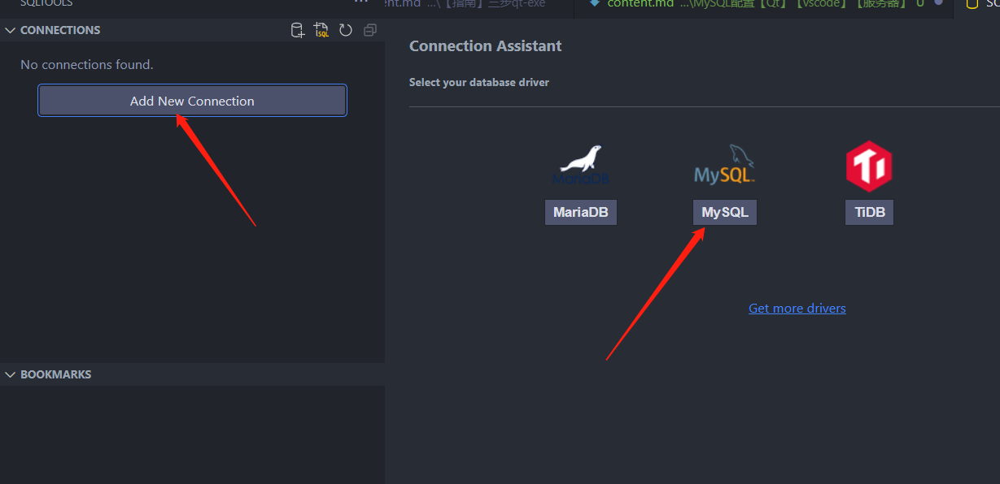

# MySQL配置【Qt】【vscode】【服务器】
[TOC]
## 本地配置好mysql
>很久之前配置的 中间很多过程真的忘记了  

好像是跟着[菜鸟教程](https://www.runoob.com/mysql/mysql-install.html)一步一步来的就行，好像安装还挺简单的，直接下载安装，放环境就可以了。
进入命令行之后 输入以下命令
```dotnetcli
mysql -u root -p
```
会进入密码输入环节，我的本地机的密码是wca123123
进入数据库之后 首先输入查看有哪些数据库的命令 主要要有**英文分号**
```dotnetcli
show databases;
```
出现了类似如下就说明 确实进来而且成功了

### 小科普：mysql登录命令详情如下
```dotnetcli
mysql -h 主机名 -u 用户名 -p
```
+ -h : 指定客户端所要登录的 MySQL 主机名, 登录本机(localhost 或 127.0.0.1)该参数可以省略;
+ -u : 登录的用户名;
+ -p : 告诉服务器将会使用一个密码来登录, 如果所要登录的用户名密码为空, 可以忽略此选项。
## 基于vscode畅玩MySQL
首先，建议到如下地址的地方打开vscode，因为会生成一些sql文件

虽然在系统自带的cmd或者vscode的cmd都可以对数据库进行连接 更改等操作，但是我还是更喜欢有一个**集成**在vscode中的，**可视化**更好的工具来帮助进行一系列的操作。
**先装上面的 再装下面的**
这里选择安装了如下的拓展 (左边拓展名 右边作者 防止下错)
>SQLTools                   | Matheus Teixeira
SQLTools MySQL/MariaDB/TiDB | Matheus Teixeira


图标如下图所示

在安装完毕之后，左边应该就会出现这个拓展的图标。
之后



之后就可以进行 正常的增删改查  而不是在命令行运行，也不需要其他软件了。

暂时不用的句子**注释掉**就可以了，我目前也不知道怎么只运行其中一句，只能把不用的注释掉先，它需要全部运行。
## MySQL in Qt
[教程](https://blog.csdn.net/joey_ro/article/details/105411135)
### 1.查看已有驱动
首先 在项目的pro文件中
```dotnetcli
QT += sql
```
然后在需要连接的cpp文件中
```dotnetcli
#include <QSqlDatabase>
```
cpp随便找个地方加入如下
```dotnetcli
qDebug()<<"available drivers:";
QStringList drivers = QSqlDatabase::drivers();
foreach(QString driver, drivers)
qDebug()<<driver;
```
我的输入如下
```dotnetcli
available drivers:
"QSQLITE"
"QODBC"
"QPSQL"
```
发现是缺少QMYSQL的,你也可以去尝试QMYSQL去找找个编译驱动，但是听说很麻烦，于是决定直接ODBC去连接MySQL
### 2.使用ODBC去进行连接
今天先写到这吧 后面要用到了再研究 230814

## 常用命令速查
### 一、进入MySQL前
#### 1.登录
登录本地MySQL带密码的直接下面这个就行 
```dotnetcli
mysql -u root -p
```
但也别忘了这个命令的完整版
```dotnetcli
mysql -h <主机名> -u <用户名> -p
```
### 二、进入MySQL后查看
>命令的最后基本都有英文分号 不要遗忘
#### 1.查看所有数据库
```dotnetcli
show databases;
```
#### 2.进入一个数据库
```dotnetcli
use 库名;
```
#### 3.查看当前所在数据库
```dotnetcli
select database();
```
#### 4.查看该库所有表
```dotnetcli
show tables;
```
#### 5.查看表内信息
```dotnetcli
show columns from <表名>;
```
或者是
```dotnetcli
SELECT * FROM t_student;
```
#### 6.退出MySQL
```dotnetcli
exit
```
### 三、常用增删改查
#### 1.创建数据库
```dotnetcli
create database <数据库名>;
```
#### 2.删除数据库
```dotnetcli
drop database <数据库名>;
```
#### 3.创建表
类似于
```dotnetcli
CREATE TABLE t_student(
  id    BIGINT          PRIMARY KEY AUTO_INCREMENT,
  name  VARCHAR(25)     UNIQUE,
  email VARCHAR(25)     NOT NULL,
  age   INT             DEFAULT  17
  );
```
有关常见的数据结构见[这](https://www.runoob.com/mysql/mysql-data-types.html)
### 4.删除表
```dotnetcli
DROP TABLE <表名>;
```
### 5.插入数据
以上面创建的表为例
```dotnetcli
INSERT INTO t_student (id,name,email,age)
                       VALUES
                       (1,"王常安","602514418@qq.com",23);
```