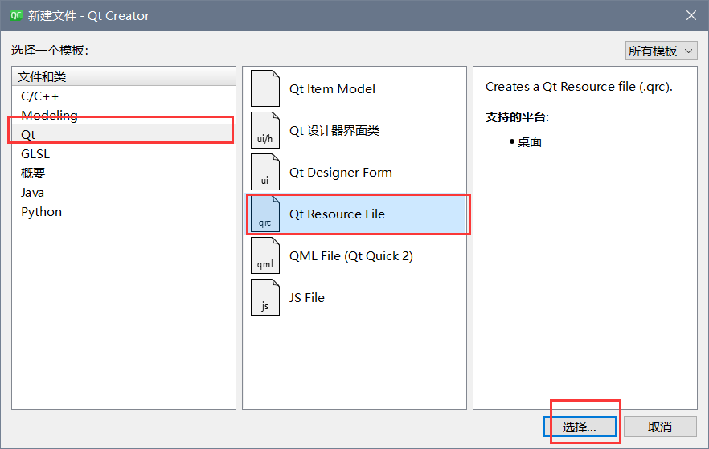

# QT Creater使用教程
[TOC]
## 1.文件结构
在对项目进行创建的过程中选择**qmake**和**qt widget**，这是一个简单的窗口，可以自行的去添加东西，另外一个我不是很了解。    
下面是编辑区的文件目录。

界面文件里面的widget.ui双击之后可以在左侧的设计界面里面去通过拖拽组件的方式来进行界面的设计，而不用去关心底层的细节，非常好用。
在.pro文件中主要是一些项目的配置说明默认状态如下
```cpp
QT       += core gui

greaterThan(QT_MAJOR_VERSION, 4): QT += widgets

CONFIG += c++17

# You can make your code fail to compile if it uses deprecated APIs.
# In order to do so, uncomment the following line.
#DEFINES += QT_DISABLE_DEPRECATED_BEFORE=0x060000    # disables all the APIs deprecated before Qt 6.0.0

SOURCES += \
    main.cpp \
    widget.cpp

HEADERS += \
    widget.h

FORMS += \
    widget.ui

# Default rules for deployment.
qnx: target.path = /tmp/$${TARGET}/bin
else: unix:!android: target.path = /opt/$${TARGET}/bin
!isEmpty(target.path): INSTALLS += target

```
在qmake中配置文件常见变量的含义如下

不过很多东西暂时不需要去管他 默认的就行
>qmake是构建项目的软件，他根据.pro文件来生成MakeFile文件，之后让C++编译器进行编译和链接
## 2.UI编辑部分的学习
下面这一张图就可以表示基本的逻辑

右边的从上到下都是父类和子类的关系 ，点击组件后可以到对应的层级进行修改
不仅仅可以在ui编辑器里面进行更改，也可以在wediget.cpp里面进行更改

## 3.使用Dialog进行信号槽关联学习demo
之前是使用wediget来实现，现在我们要通过dialog来实现对于文字样式的修改，大意如下
**通过这个小demo加强对于信号槽的理解**
### 3.1 添加资源文件
左上角点击文件 ，然后new file，然后按照下图所示进行选择。

点开qrc之后，要把文件需要在本地项目文件夹内才可以进行导入，需要提前进行手动处理，处理之后是这样子的

### 3.2 构建一个项目基本原理


