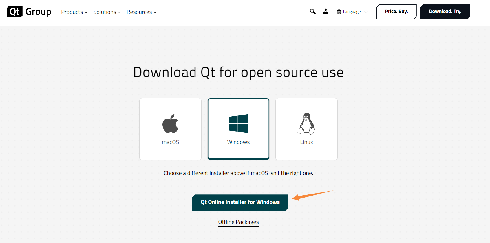
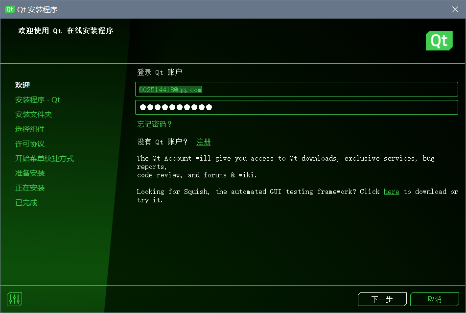
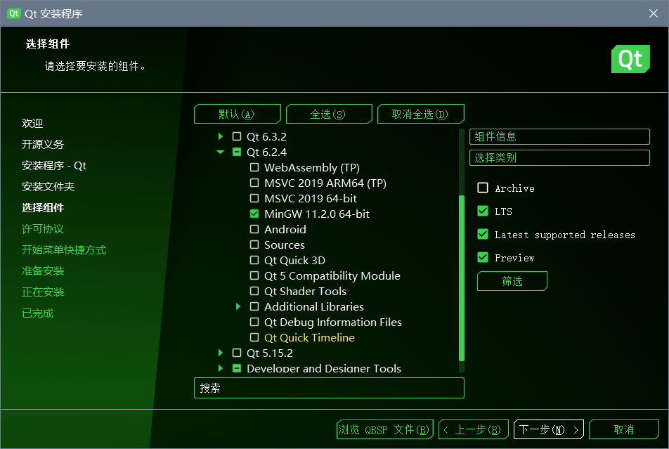

# QT安装及配置
[TOC]  
>本文档主要基于一[B站教程](https://www.bilibili.com/video/BV1km4y1k7CW?p=3&vd_source=b346459f7795c076b1bbeb6f1493bb3a)的p3
## 1.官网下载  
QT是有官方开源版本的，我一开始就下错了，注意版本辨别。视频教程里的网址有误，实测真正的开源版本的官网下载连接[在此](https://www.qt.io/download-qt-installer-oss?hsCtaTracking=99d9dd4f-5681-48d2-b096-470725510d34%7C074ddad0-fdef-4e53-8aa8-5e8a876d6ab4)  
  
选择win版本安装
安装完成之后记得检查一下安装包名字是否叫下面这个(至少23.06.05还是这个版本名 如果是6.x 那肯定就不是开源版本了 记得重下 在这里及时止损)
```dotnetcli
qt-unified-windows-x64-4.5.2-online.exe
```
## 2.镜像安装
**不要直接打开exe！！！**   
在cmd里面用镜像来进行打开
cmd到这个安装包exe所在文件夹 我们使用阿里云的镜像来进行操作
```dotnetcli
qt-unified-windows-x64-4.5.2-online.exe --mirror https://mirrors.aliyun.com/qt
```
然后命令会结束 然后弹出来如下窗口
  
+ 首先是要qt账户进行登录 没有的话记得注册 我之前已经注册过了
+ 勾选同意
+ 勾选我是个人用户（之后下一步）
+ 点击第二项（disable sending.....）下一步
+ 选择安装目录 下面的默认（注意要是空文件夹！）下一步
+ 选择组件方面，首先点击LTS（长时间支持版本）  然后点击筛选
+ 在【Qt】里面选择【Qt 6.4.2】(这一步看自己需求)
+ 组件选择如下图所示 大部分组件以后需要用到再进行安装
  
+ 之后一路下一步进行安装 实测等待十分钟不到即可 但教程里说要1到2个小时 我也很疑惑 没准是我之前没卸载干净有残留
**到此安装全部结束**
## tips
如果之后想要对qt的模块进行增删的话 找到如下文件运行即可
