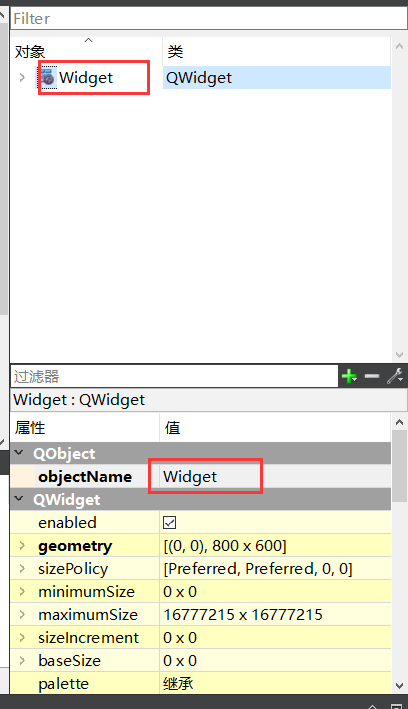

# Qt问题汇总
[TOC]
## debug模式运行时出现错误（ver1）
报错显示：
```dotnetcli
QT: error: invalid use of incomplete type 'class Ui::Widget' , ui(new Ui::Widget)
```
原因是在ui设计界面对窗口对象的value值进行了重命名，导致无法匹配，以后这个地方不能重命名，保持原名就好。如果一定要命名，就仔细研究一下widget.cpp里面的内容

## 赋值语句要写在函数里面
问题：mainwindow.cpp:: A type specifier is required for all declarations    
## debug模式切换到release模式 找不到ui_xx.h
不知道咋回事就好了  多关闭打开
## qt引入.h .lib .h
>看[这里](https://blog.csdn.net/qq_36883399/article/details/109429909)
## 一些字符串转化
### QString转char*
```cpp
MyQString.toStdString().data();
```
### QString转const char*
```cpp
MyQString.toStdString().c_str();
```