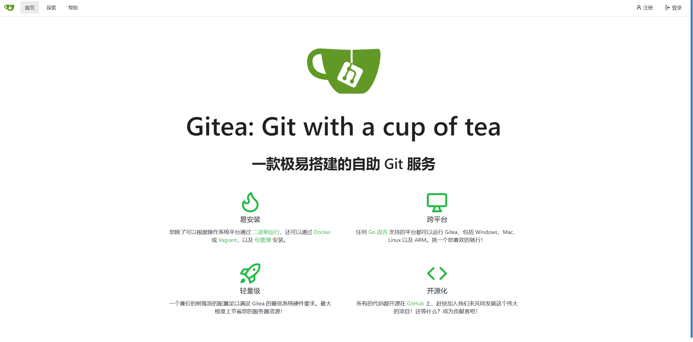

# docker配置gitea
>主要跟随[教程](https://blog.csdn.net/qq_45173404/article/details/122277620)的第二部分【Docker安装方式】
[TOC]

## 我的gitea管理员账号密码
账号：wca_admin
密码：123456

>注意 防火墙 不仅要在华为云等运营商的控制台打开端口 也要在命令行手动使用命令打开端口并且检查
之后就可以顺利打开了

