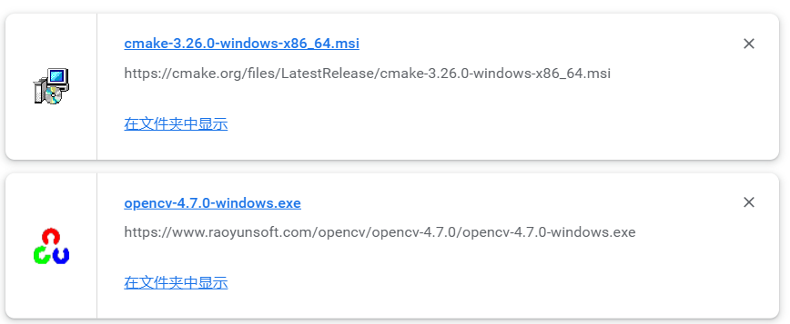

# opencv环境配置（基于windows-qt）
[TOC]
>主要基于CSDN[教程](https://blog.csdn.net/weixin_43763292/article/details/112975207)
+ cmake下载的时候可能有点慢虽然只有30多m 但是要下一段时间 最后还是决定找了个[镜像](https://cmake.org/files/LatestRelease/)
+ opencv 100+m很慢 找了个[镜像](https://www.raoyunsoft.com/wordpress/index.php/2020/03/09/opencvdownload/)
## 我个人安装的版本


## 遇到的小问题
一直都跟着做没啥问题 到了最后一步出了点小问题 说找不到对应的dll文件，但是那些文件命名就在里面只不过后面加了一个.a而已
>已解决，解决方法：重启，使path正式装载，从而能被qt找到


## 附赠py opencv
```dotnetcli
pip install opencv-python  -i https://pypi.tuna.tsinghua.edu.cn/simple
```