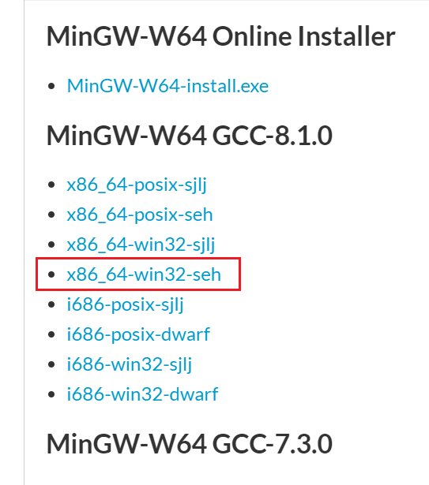
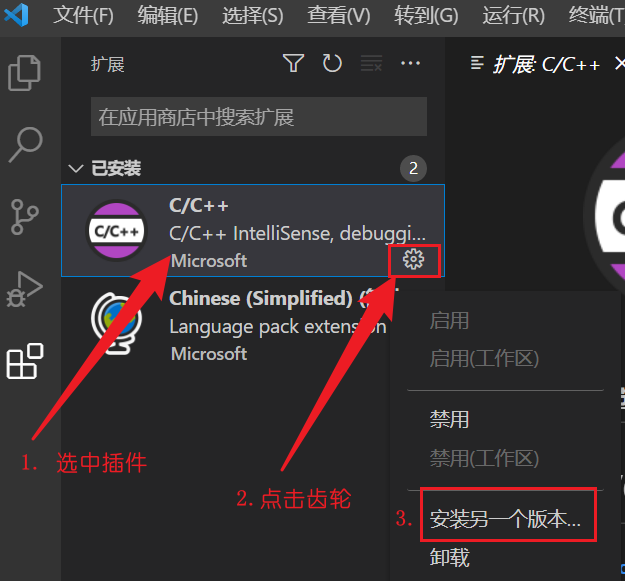

# vscode上最简单方便的cpp环境搭建及优化
>[参考教程](https://www.bilibili.com/video/BV1Cu411y7vT/?spm_id_from=333.1007.top_right_bar_window_custom_collection.content.click&vd_source=b346459f7795c076b1bbeb6f1493bb3a) 
(ps:全程路径中都不要有中文)   

[TOC]
## 1.环境配置
mingw安装：https://sourceforge.net/projects/mingw-w64/files/
找到适合自己的版本
不知道选啥就选这个  

然后把mingw\bin路径放在path里就行
## 2.插件安装和运行
+ 先确保code runner cmake啥的都没安装 保持纯净，因为可能会有冲突  
+ 安装微软官方的c/c++然后回退版本到**1.8.4**,只有这样才能自动生成部分文件

### 具体插件配置环节
+ 随便在工作区创建一个c/c++文件
+ 点运行中的前两个任意一个都行(快捷键F5)
+ 第一个选择**C++(GDB,LDB)**
+ 第二个选择 **g++.exe**(如果是c语言环境 建议gcc 虽然两者很多时候都能相互兼容 但还是对口好一些)
+ 之后就会在.vscode文件夹中生成task和launch两个json文件
  
## 3.外部控制台中运行程序(可选)
在launch中,将c**onfigurations**中的下列代码改成true
```dotnetcli
"externalConsole": true,
```

## 4.GBK编码(可选)
在task中，tasks字典中的args后逗号，然后回车填上两行，改动后如下所示     
别人教程里面只有一个-fexec-charset=GBK，但是发现会报错说识别非法的数据，于是就找到了另外一行用来判别输入的字符串也是GBK编码
```dotnetcli
"args": [
                "-fdiagnostics-color=always",
                "-g",
                "${file}",
                "-o",
                "${fileDirname}\\file_exe\\${fileBasenameNoExtension}.exe",
                "-fexec-charset=GBK",
                "-finput-charset=GBK"
            ],
```
## 5.统一收纳exe文件(可选)
在task和launch中可以很明显的看到有关exe的路径,默认是在工作区间下，可以中间加上位置，改动成特定的文件夹  
下列中的file_exe可以换成任何你想要的文件夹的位置
+ tasks.json->tasks->args
```dotnetcli
"${fileDirname}\\file_exe\\${fileBasenameNoExtension}.exe",
```
+ launch.json->configurations->program
```
"program": "${fileDirname}\\file_exe\\${fileBasenameNoExtension}.exe",
```