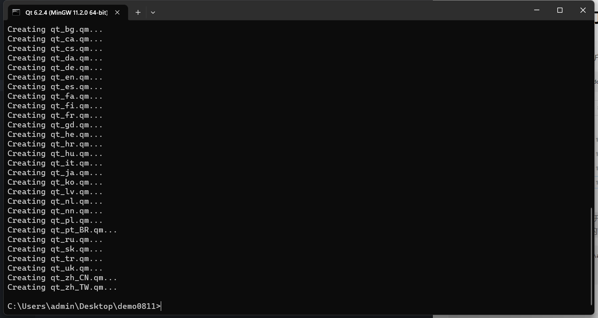

# 【指南】三步打包qt-exe
[TOC]
## 1.release运行
使用qtcreator进行一次【运行】操作，红框标的就是。
但是要确保这一次是顺利运行没有报错的，否则先修改错误。
>一定要是在**release模式**下进行运行，无论是MinGW还是MSVC编辑器都是次要的。  


之后 找到刚在运行产生的exe文件夹，在对应的build文件夹，位置如下。
在**默认条件**下，项目文件夹和build出来的文件夹，在一个文件夹下面。

仔细对比**文件夹名字**，就可以知道自己需要进入哪个文件夹。
进入文件夹之后 找到里面的release文件夹

不出意外的话，里面只有一个exe文件，**确认一下**更改时间，应该就是刚才在qtcreator运行成功那一次的时间。
将刚才找到并复制的exe文件，粘贴到一个**空文件夹**中，没试过含中文路径行不行
>我一般是在桌面建立一个文件夹demo几月几号,然后粘贴进去，等完全打包好的exe出来之后再把那个单独的打包exe转移到其他收纳的地方(然后其他东西删了就行)
## 2.利用qt专属的cmd初步打包
下述以MinGW为例.
在**默认情况**下，大致位置如下,根据自己用户名，版本名等情况小改即可。
```dotnetcli
C:\Users\admin\AppData\Roaming\Microsoft\Windows\Start Menu\Programs\Qt\6.2.4\MinGW 11.2.0 (64-bit)
```

>可以把这个快捷方式**复制**一份到方便点开的地方
打开cmd后先进入到自己刚刚粘贴exe的文件夹,例如如下
```dotnetcli
C:\software\qt\QT\6.2.4\mingw_64>cd C:\Users\admin\Desktop\demo0811

C:\Users\admin\Desktop\demo0811>
```
然后输入  (exe名根据实际变通)
```cmd
windeployqt SZPTWebCam.exe
```
>ps.输入windeployqt后按一下空格，再按一下tab 可以自动补全后面的exe全名。

然后回车，闪过很多行，出现下面这个结尾基本上就是成功了。

这个时候 如果项目中不含第三方库的话，这个文件夹已经可以直接整个打包发给没有配置环境的其他人了。（但公司的产品是一定会有opencv和自己的第三方库的）
>如果要打包成**一个exe**，看【3】
如果想正确且完整补充项目包含的**第三方库**,先看【4】，执行完了之后再看【3】。**(大多数情况)**
## 3.将文件夹中文件压缩成一个exe
使用这个软件(安装包在压缩包内)

点开之后，按照如下图所示操作

图片有些地方描述的不是很清楚，下面是**补充**：
+ ②中选择第二个选项 【Add Folder Recursive】
+ ③中选择勾选【Compress Files】另一个不勾


## 4.补充：引入第三方库
我会给你一个文件夹 每次第2步结束后 第3步开始前 全选+复制(ctrl a+ctrl c) ，然后粘贴到exe所在文件夹，应该会有11个重复文件，选择**替换**。
>这里面其实不是所有文件都必须复制粘贴  **只有其中几个**是关键的 但我还没找出来，尝试了好久都失败了 以后再遍历地找吧 可以实现exe文件的**瘦身**
