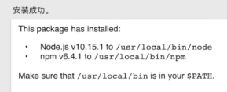

# 个人博客的搭建过程
本博客主要是基于b站程序羊的[视频](https://www.bilibili.com/video/BV1Yb411a7ty/?spm_id_from=333.788.recommend_more_video.0&vd_source=b346459f7795c076b1bbeb6f1493bb3a)的启发和指导(以及[另一个](https://www.bilibili.com/video/BV1334y1q72q/?spm_id_from=333.337.search-card.all.click&vd_source=b346459f7795c076b1bbeb6f1493bb3a))
博客的搭建基于**hexo框架**
## nodejs的安装（LTS版本）
安装完之后会有两个组件 一个是nodejs本身   
一个是npm的**包管理器**   
  
发现自己在21年已经安装过了 不知道当时是安装来干啥的来着
## node和npm的版本 

## npm镜像换源
国内安装很慢 利用npm全局安装淘宝的源 cnpm
```dotnetcli
npm install -g cnpm --registry=https://registry.npm.taobao.org
```
出了点小错 重名了 难道是我之前安装过了

但是检查版本时没炸到  看来遇到第一个bug了
看warn里面有个提示说我版本低了 准备重新安装一下
新的node和npm的版本分别是18.15.0和9.5.0  
居然重装之后再运行真的成功了 很奇怪

但输入cnpm没有反应  但是重启了一下cmd 解决了 版本9.1.0
## 安装hexo
```dotnetcli
cnpm install -g hexo-cli
```
反正我输入之后就很顺利的安装成功了  
```dotnetcli
hexo -v
```
hexo版本4.3.0
## 初始化并启动hexo
在vscode自带终端里面hexo找不到 不知道咋回事
但是在外置的cmd里面还是可以找到的
```dotnetcli
hexo init
```
一定要在空的文件夹里面才能进行 否则会失败  
要从github里面进行克隆 要提前加速
没爆红就是成功了 我是一次成功了

之后**启动**自己的博客（后续可以放到自己的ip上 现在是localhost调试）
```dotnetcli
hexo s
```
从4000端口进入界面 已经是一个看起来比较不错的博客页面样式了

## 创建属于自己的博文
创建命令
在初始化hexo的文件夹下面
```dotnetcli
hexo n  "我的第一篇 博客"
```
新建博客的位置在\source\\_posts\中
可以进行清理一下
（虽然暂时不知道clean有啥用）
```dotnetcli
hexo clean
```
生成一下 generate
```dotnetcli
hexo g
```

之后你的所有博客就都可以在页面上显示了

## 将博客部署到远程服务器
```dotnetcli
cnpm install --save hexo-deployer-git
```
我安装的版本是4.0.0  
要**新建**一个仓库 一定要是以下仓库名字的格式 最前面是自己的id
```dotnetcli
NBHHWCA.github.io
```
之后是对_config.yml进行设置
翻到**最下面** 设置成如下格式
+ 这里一定一定是main不是老版本的master  
```dotnetcli
deploy:
  type: git 
  repo: https://github.com/NBHHWCA/NBHHWCA.github.io.git
  branch: main
```

  
之后是对这个仓库进行**git初始化**
```dotnetcli
git config --global user.email "602514418@qq.com"
git config --global user.name "NBHHWCA"
```
之后进行部署到远端
```dotnetcli
hexo d
```
之后就成功了 查看仓库  发现也已经上传上去了 其实我这个文件夹还没有git init 结果就已经上传了  
之后网址栏 输入仓库名的那个 NBHHWCA.github.io 就可以进入了 和本地测试时候是一样的界面
## 更换博客主题
根据up主的推荐 有个博主设计的很多主题都很棒 访问如下网址
```dotnetcli
github.com/litten/hexo-theme-yilia
```
点进去之后 依然是在当前的这个Blog的位置 按照里面的教程一步一步来就可以了
弄好之后再重新三步走(三步分开进行)
```dotnetcli
hexo clean
hexo g
hexo d
```
每次hexo d某种程度上也是一种 特殊的git push
## 欣赏欣赏别人的几个博客
```dotnetcli
https://senqi666.gitee.io/
https://motongxue.cn/
```
## github太慢 准备转移到gitee上


## 搭建图床
当前的图片插入形式过于臃肿 听说gitee的白嫖方式也被封了
于是想试一试picgo+腾讯云的对象存储

