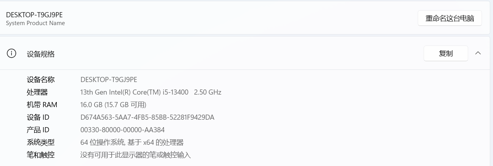
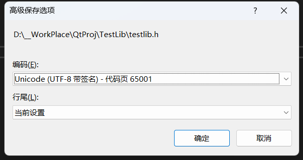

#在qt中导入外部lib记录
>寻求新外部环境引入的最简方式 也包括opencv的最简引入方式
[TOC] 
>【已完结 涉及到的问题全部解决】  先说结论 配置好qt的2019MSVC就能成功了  否则用mingw的方式啊 lib转a的方式啊 都不好使，具体细节看下面就行了。

## 空白项目创建
为了确保是可以从零进行的，创建了一个新的项目进行记录和验证。
用的是前两天拿到的偏振相机相关的算法dll。
>第一件事情就是切换到 mingw的release版本
## 先测试opencv
首先参考的是之前用的[教程](https://blog.csdn.net/weixin_43763292/article/details/112975207)反正之前测试的时候是直接一次成功的。
+ 注意 是**mingw**版本
其核心的部分在于
```cpp
INCLUDEPATH += C:\software\opencv\opencv-build\install\include
LIBS += C:\software\opencv\opencv-build\lib\libopencv_*.a
```

但我在想能不能把这个换成相对路径 这样子 项目包进行迁移的时候也可以更加方便 ，不用重新弄环境了。
>教程里面有一个地方有错误，那就是文件的路径方面必须用双反斜杠，而不是单斜杠，换一下就行。具体的测试代码可以参考如下两段
```cpp
#include <opencv2/core/core.hpp>
#include <opencv2/highgui/highgui.hpp>
#include <opencv2/imgproc/imgproc.hpp>
using namespace cv;
```
```cpp
    Mat image=imread("D://1.jpg",1);//一定要使用绝对路径，其他可以回报错
    namedWindow( "Display window", WINDOW_AUTOSIZE );
    imshow( "Display window", image );
```
一次就成功了，看来非常**有效**
+ ps:如果有ui什么什么找不到或者opencv爆红 可以拖动一下ui界面的部件然后保存，或者重新执行qmake一般都会恢复。
## 试试能运行opencv的最小包含打包
1. 把release之后的exe放到新的空文件之后，点击可运行。
2. windeployqt之后，点击可以直接运行。但是现在打包肯定是不行的。
3. 灵机一动想试一试只放一个opencv_world470试试。可以运行 记得在d盘下面放一个1.jpg（打包好发给文件助手回家试试 打包好 在公司电脑 还是没有问题的）
4. 把线程中

## 尝试第三方h lib dll进行导入
找到一个教程 尝试步骤如下：
+ 把h和lib都放在工程文件夹下面 即pro那个文件夹
+ 添加现有文件 然后添加.h
>中途碰到了识别不了BOOL 于是显式引用头文件#include <minwindef.h>//用来识别BOOL定义
但是偶尔会出现 In included file: "No Target Architecture"      的报错。解决方法，不用minwindef而是 在头文件最开始引用windows.h
+ h头文件引入之后运行 说明h本身没有问题，下面准备开始引入lib
+ 右键添加库->外部库 我的配置如下

+ 上来运行就报错了 准备其他操作不变改用动态链接
+ 至少动态的能直接运行 那看来就是动态了
>运行之后出现报错 undifined reference to  怀疑是库依然没有完全引入进去
+ 好像是mingw不能使用lib而要使用.a 找了个教程试试
+ 网上的教程都是要reimp 但是我尝试之后怎么都不行弄完之后没有反应
+ 又听说reimp是老版本才有的 现在mingw(>=4.6.2)都可以兼容lib
+ 还是不行还是不行 没办法了 改为msvc进行编译 但是出现了一个错误no target architecture 以及一些错误 就是之前经常见到过的 **文件包含在偏移xxx处开始的字符**
+ 上面第一个notarget的问题找到了 引入windows.h就可
+ 学会了使用工具探寻lib和dll中的函数 写在另一个blog中了
+ 回到我的vs2013 但是出现了以下报错
      
+ 不知道调了什么东西 但是后来已经变成了下面这种报错 连啥都不加都打不开了
```dotnetcli
The process failed to start. Either the invoked program "D:\__WorkPlace\QtProj\build-TestDLL-Desktop_Qt_6_2_4_MinGW_64_bit-Release\release\TestDLL.exe" is missing, or you may have insufficient permissions to invoke the program.
```
+ 打开了vs进行调试 全部换成自己的环境 之后又通过微软那个符号的那个下载，第一次挺慢的。然后是能够顺利运行的说明文件本身是没有问题的
 
 然后换了一张图，但是发现还是一样的情况，说明功能是对所有功能都适用，但是
 

 今天是0807,尝试了一些办法还是不行。重新开了一个项目想重新复刻，发现opencv引入库的形式就是.a的形式，于是决定还是尝试把lib变成a试试。
尝试使用libtool去进行一定的学习，但是搞半天没搞好，决定转向msvc了，刚刚查看到了一个[教程](https://blog.csdn.net/caolinqing1/article/details/107714914)给了我启发，确实在win上的话，msvc才是王道。又在知乎上看了一下，发现确实之前还是迷信mingw了，以后尽量都用msvc好一点。
## 尝试从MSVC上重新弄
创建项目之后发现就项目出错了，一看，应该是qt的msvc编辑器环境没有配置，而且也不想mingw可以找到，反应过来应该是系统path没有配置的问题，效仿mingw找到了文件的位置
```dotnetcli
C:\software\qt\QT\6.2.4\msvc2019_64\bin
```
配置好系统环境之后，重新打开qt项目还是没有找到，于是想
想切回之前偏振相机的项目看是咋配置的，但发现也不能用msvc了 很奇怪
准备重启试试看
重启之后还是没有找到。
>arm64和64的区别在于 前者是arm架构，后者是x86架构，指令集是不一样的。
在设置中可以看到自己的电脑属于什么架构，可以看到属于x64

也可以在cmd中输入命令
```dotnetcli
echo %PROCESSOR_ARCHITECTURE%
```
输出结果为**AMD64**  总之显然不是arm架构
自己在qt上手动选择了一个msvc的编辑器还是不行，图标和mingw的不一样，看来要按照教程[下载](https://blog.csdn.net/bailang_zhizun/article/details/117774431)东西了
顺利安装成功，听说安装好了重启一下就行，我试试。
重启之后依然没有教程中的样子，准备重新创建一个项目试试。
发现可能是msvc版本不够支撑，需要msvc2019，于是又找了一个[教程](https://blog.csdn.net/zjgo007/article/details/114296400)进行尝试
要在旧版本[下载](https://my.visualstudio.com/Downloads?q=2019) 

貌似是这个

别忘了还要下载这个

但是却出现了如下错误，我怀疑是下载顺序错了，我把前面的生成工具卸载试试
再重启再找，一开始还没找到，后来到下面找，终于找到了。看来就是msvc2019版本的问题。
正确配置如下，看编译器那两行

之后打开程序也是顺利成功！
开始测试MSVC上的opencv配置
引入外部库配置如下 

库文件的地址在
```dotnetcli
C:\software\opencv\build\x64\vc16\lib
```
非常顺利的成功了 pro文件如下 下面的四句我不知道哪些是必须的 但是全部注释掉会报错
```dotnetcli
win32: LIBS += -LC:/software/opencv/build/x64/vc16/lib/ -lopencv_world470

INCLUDEPATH += C:/software/opencv/build/x64/vc16
DEPENDPATH += C:/software/opencv/build/x64/vc16

INCLUDEPATH += C:/software/opencv/build/include
DEPENDPATH += C:/software/opencv/build/include
```
引入头文件之后，虽然运行没有问题，但是出现了很多警告，以前也经常见到，但是都没有解决。

忽略上述警告
## 警告C4828:文件包含在偏移0x***处开始的字符，该字符在当前源字符集中无效
还是决定来尝试弄弄，我看[教程](https://blog.csdn.net/qq_45220555/article/details/111660406)说是文件编码的问题不对.
按照教程来的时候，一开始没有高级保存选项，后来通过工具->自定义->文件->命令  里面找到高级保存选项，然后就可以实现一个，自定义的保存。如下图所示。

之后保存为如下格式

但是回到qt试了一下 还是不行 还是那些报错 找到对应的.h发现报错为
```dotnetcli
could not decode with utf 8 encoding
```
按照[教程](https://blog.csdn.net/Dasis/article/details/120506368)里面三个步骤一步一步来就可以了 一定不能跳步，一开始是找不到utf8的 然后按编码保存 之后就不报错了
**成功**
## 终于出来了！！
先放图

最终.h代码如下
```cpp
#include <windows.h>
#include <opencv2/core/core.hpp>  
#include<opencv2/highgui/highgui.hpp>  
#include"opencv2/imgproc/imgproc.hpp"

using namespace std;
using namespace cv;

void IImage(Mat img0, Mat img60, Mat img120, int w, int h, BOOL flag);//强度计算 I
void StokesImage(Mat img0, Mat img60, Mat img120, int w, int h, BOOL flag);//偏振解析 I Q U
void PZImage(Mat img0, Mat img60, Mat img120, int w, int h, BOOL flag);//偏振计算 I DOP AOP

extern Mat OI;//图像缓存
extern Mat OQ;//图像缓存
extern Mat OU;//图像缓存

extern Mat ODOP;//图像缓存
extern Mat OAOP;//图像缓存
```
cpp代码如下
```cpp
#include "testlib.h"
#include "ui_testlib.h"
#include "szpt.h"
#include <opencv2/core/core.hpp>
#include <opencv2/highgui/highgui.hpp>
#include <opencv2/imgproc/imgproc.hpp>

using namespace cv;
Mat OI, OQ, OU, ODOP, OAOP;
TestLib::TestLib(QWidget *parent)
    : QMainWindow(parent)
    , ui(new Ui::TestLib)
{
    ui->setupUi(this);
//    Mat image=imread("D://2.jpg",1);//一定要使用绝对路径，其他可以回报错
//    namedWindow( "Display window", WINDOW_AUTOSIZE );
//    imshow( "Display window", image );

    cv::Mat src1 = cv::imread("D://0.bmp");
    cv::Mat src2 = cv::imread("D://60.bmp");
    cv::Mat src3 = cv::imread("D://120.bmp");

    cv::Mat I;
    int w = 640;
    int h = 420;

    IImage(src1, src2, src3, w, h, TRUE);
    StokesImage(src1, src2, src3, w, h, TRUE);
    PZImage(src1, src2, src3, w, h, TRUE);

    cv::imshow("I",OI);
    cv::imshow("Q", OQ);
    cv::imshow("U", OU);
    cv::imshow("DOP", ODOP);
    cv::imshow("AOP", OAOP);


    cv::waitKey(0);
}

TestLib::~TestLib()
{
    delete ui;
}
```
### 小问题:构建报错 但运行可以
在按照上面的正确的步骤MSVC版本的配置完成之后，进行进行构建的时候会显示报错，但是运行却很完美，能够直接运行，很奇怪。


