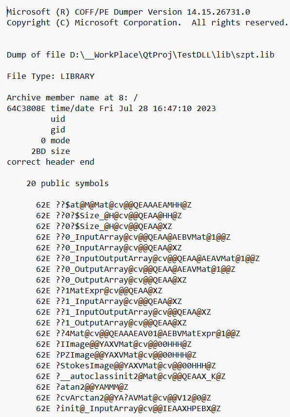

# 解析lib dll中的函数
[TOC]
>主要依照[教程](https://blog.csdn.net/yushengqi12345/article/details/128701715)
## 正式记录
首先根据教程里面的路径差不多找到那个文件夹，我的地址如下
```dotnetcli
C:\software\VS\Microsoft Visual Studio\2017\Community\VC\Tools\MSVC\14.15.26726\bin\HostX64\x64
```
进入这个文件夹之后，不要点击任何exe，在地址栏输入powershell进入ps。
教程里说的是用git但我这个电脑暂时还没有安装git。
进入之后不需要移到lib所在文件夹，就在当前位置运行如下命令
>如果要在gitbash中进行，要先把这个文件夹加入环境变量
而且在gitbash中 如果有目录中间带空格的话 要用**两边单引号**包起来
```dotnetcli 
 .\dumpbin.exe -LINKERMEMBER     "D:\__WorkPlace\QtProj\TestDLL\lib\szpt.lib" > "D:\__WorkPlace\QtProj\TestDLL\lib\A.txt"
```
教程里面没有最开始的.\ 我是根据第一次的报错提示加上去的，然后就成功了，在指定的位置生成了txt。

还是看得出来一些我需要的函数在里面的，但是有很多乱码很不爽，尝试修改编码格式，另存为了很多版，所有能选的编码格式都尝试了还是一样，那就先这样吧。